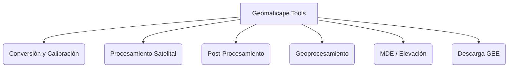

# Geomaticape Tools 🛰️📐

[](https://qgis.org/)
[](https://www.python.org/)
[](LICENSE)
[](https://www.geomatica.pe/)
[](mailto:nino@geomatica.pe)

**Geomaticape Tools** es un complemento (*plugin*) profesional y de alto rendimiento para **QGIS**, desarrollado por **Geomatica Ambiental**. Está diseñado para automatizar el procesamiento, análisis espacial y modelamiento de imágenes satelitales multiespectrales, facilitando tareas complejas de teledetección, machine learning y geoprocesamiento vectorial en un entorno unificado y optimizado.

---

## 🚀 Características Principales

El complemento organiza sus herramientas en menús lógicos y optimizados para el flujo de trabajo geoespacial:



### 1. 🛰️ Conversión y Calibración Radiométrica
Herramientas avanzadas para convertir niveles digitales (DN) a reflectancia y temperatura física en la superficie:
*   **RS Landsat C2 L1 (SR + LST + PAN)**: Preprocesamiento completo que autodetecta sensores (MSS, TM, ETM, OLI/TIRS) y calcula la reflectancia de superficie, temperatura de brillo y pansharpening integrado.
*   **Factores de Escala Landsat C2 L2**: Conversión automática a Reflectancia de Superficie (SR) y Temperatura de Superficie (LST) para la Colección 2 Nivel 2.
*   **Calibración Sentinel-2**: Aplicación rápida y precisa de factores de escala para productos **Sentinel-2 L1A** y **Sentinel-2 L2A**.
*   **Módulo MODIS Independiente**: Corrección y escala adaptada para productos específicos:
    *   **MODIS 09**: Reflectancia Superficial.
    *   **MODIS 11**: Temperatura de Superficie (LST) en grados Celsius (°C).
    *   **MODIS 12**: Cobertura de Suelo.
    *   **MODIS 13**: Índices de vegetación (NDVI / EVI).

### 2. ⚡ Procesamiento de Imágenes
Herramientas avanzadas de mejora espacial, análisis espectral y reducción de dimensionalidad:
*   **Pansharpening de Alta Calidad**:
    *   **CBERS-04A**: Fusión espacial Brovey para lograr resoluciones de hasta 2 metros.
    *   **Landsat**: Fusión ponderada Brovey (Weighted Brovey) de 30m a 15m.
*   **Análisis de Componentes Principales (ACP/PCA)**: Reducción de redundancia espectral aplicable a cualquier sensor.
*   **Tasseled Cap Transform**: Transformación matemática para derivar índices de Brillo (*Brightness*), Verdez (*Greenness*) y Humedad (*Wetness*).
*   **Módulo de Índices Espectrales**: Cálculo optimizado de **17 índices espectrales** clave (NDVI, NDWI, EVI, SAVI, etc.).
*   **Firma Espectral Profesional**: Extracción de firmas espectrales para Landsat 5/7/8/9, Sentinel-2 y ASTER L1T agrupados por clases (promedio, mínimos y máximos) con generación automática de gráficos y exportación a tablas de Excel.
*   **Extracción y Combinación**:
    *   Mapeo y extracción individual de bandas multiespectrales con detección automática de cantidad de canales.
    *   Combinación ágil de bandas usando nombres estándar (Red, NIR, SWIR, etc.).
*   **Recorte Inteligente**: Recorta múltiples imágenes de forma masiva usando una zona de estudio (*cutline* o caja de contorno).
*   **Mosaico y Celda Nula**: Fusión de rasters contiguos y definición rápida de valores sin datos (*NoData*).

### 3. 🧠 Clasificación de Imágenes (Machine Learning)
Módulos robustos para el modelamiento y mapeo temático del territorio:
*   **Clasificación No Supervisada**: Segmentación automática mediante algoritmos avanzados: **K-Means**, **MiniBatchK-Means**, **Gaussian Mixture Models (GMM)** y **Birch**. Incluye auto-escalado de datos.
*   **Clasificación Supervisada Avanzada**: Entrenamiento y predicción en base a píxeles o regiones de interés usando clasificadores líderes:
    *   Árboles de Decisión (Decision Tree)
    *   Bosques Aleatorios (Random Forest)
    *   Naive Bayes
    *   Perceptrón Multicapa (MLP / Redes Neuronales)
    *   K-Vecinos Más Cercanos (KNN)
*   **Validación de Clasificación**: Generación automatizada de reportes de calidad que incluyen la matriz de confusión, índice Kappa, precisión balanceada, puntuación F1 y exportación directa a hojas de Excel enriquecidas con gráficos interactivos.

### 4. 📊 Post-Procesamiento y Reportes
*   **Reclasificación por Rangos**: Clasificación directa en base a rangos personalizados de valores (mínimo / máximo / valor único).
*   **Reportes Estadísticos**: Generación de informes del área y porcentaje de cobertura del suelo, tanto para formatos raster como vectoriales.

### 5. 📐 Geoprocesamiento y Análisis Vectorial
*   **Crear Polígonos desde Tabla**: Importación automática y estructuración de polígonos desde archivos tabulares (CSV, TXT, XLS, XLSX) con gestión inteligente de coordenadas y atributos.
*   **Estadística Zonal Avanzada**: Resumen estadístico de coberturas raster dentro de límites vectoriales con exportación directa a Excel y CSV.
*   **Muestreo Multi-Punto**: Extracción de valores de múltiples rasters de manera simultánea en base a una capa de puntos.
*   **Geoprocesamiento Vectorial Especializado**:
    *   Cálculo del ángulo de orientación y dirección de polígonos.
    *   Superposición geométrica de polígonos propios.
    *   Generación de perfiles y secciones transversales (*cross sections*).

### 6. 🏔️ Modelos Digitales de Elevación (MDE/DEM)
*   **Descarga de MDE**: Herramientas integradas para obtener modelos digitales de elevación de diversas fuentes.
*   **Generación de Elevaciones Puntuales**: Extracción automática de cotas altimétricas en formato punto.
*   **Curvas de Nivel Intermedias**: Generación de curvas de nivel optimizadas y suavizadas.

### 7. ☁️ Descarga e Integración con Google Earth Engine (GEE)
*   **Descarga Masiva de Imágenes**: Consultas y descargas directas de colecciones de Landsat y Sentinel-2 sin salir de QGIS.
*   **Descarga de Índices Espectrales**: Obtención rápida de mapas de índices procesados en la nube.
*   **Firma Espectral en la Nube**: Extracción avanzada y profesional de firmas espectrales utilizando la base de datos de GEE.

---

## 🛠️ Requisitos e Instalación

El complemento es totalmente compatible con la capa de compatibilidad de **Qt5 (PyQt5)** y **Qt6 (PyQt6)**, lo que permite su funcionamiento tanto en versiones LTR como modernas de QGIS.

### Compatibilidad
*   **QGIS**: Versiones desde la **3.28 hasta la 4.99**.
*   **Sistemas Operativos**: Windows, Linux, macOS.

### 📦 Dependencias de Python

El plugin requiere de algunas librerías estándar y externas para ejecutar los algoritmos matemáticos y estadísticos:

| Librería | Requerido por | Tipo de Instalación |
| :--- | :--- | :--- |
| **`numpy`** | Todos los algoritmos y matrices raster | Incluido en QGIS (Natativo) |
| **`GDAL` / `osgeo`** | Lectura, escritura y reproyección espacial | Incluido en QGIS (Nativo) |
| **`matplotlib`** | Renderizado de gráficos de firmas espectrales | Incluido en QGIS (Nativo) |
| **`scikit-learn`** | Machine Learning (Clasificación Supervisada / No Supervisada / ACP) | **Requerido (Instalar)** |
| **`pandas`** | Lectura y manipulación de datos tabulares (Excel, CSV) | **Requerido (Instalar)** |
| **`openpyxl`** | Exportación avanzada de reportes enriquecidos a Excel (.xlsx) | **Requerido (Instalar)** |
| **`xgboost`** | Clasificación Supervisada (opcional) | **Requerido (Instalar)** |
| **`catboost`** | Clasificación Supervisada (opcional) | **Requerido (Instalar)** |

---

### 💻 ¿Cómo instalar las dependencias?

Para facilitarte la vida, **Geomaticape Tools** incluye un **Instalador Automático de Dependencias** accesible directamente desde su menú principal.

#### Método 1: Instalación Automática (Recomendado)
1. Abre QGIS.
2. Ve al menú superior: **Geomaticape** -> **Instalar dependencias de Python...**
3. El plugin detectará si falta alguna librería y te preguntará si deseas instalarla.
4. En **Windows**, abrirá una ventana segura del *OSGeo4W Shell* que ejecutará el proceso de forma limpia. 
5. ¡Espera que finalice la ventana de comandos, **reinicia QGIS** y listo!

> [!NOTE]
> En Windows, QGIS corre bajo su propio entorno de Python. El instalador automático localiza de forma precisa la ruta del shell de OSGeo4W para evitar conflictos con otras instalaciones de Python del sistema.

#### Método 2: Instalación Manual por Terminal

Si prefieres realizar la instalación manualmente:

*   **En Windows (OSGeo4W Shell)**:
    Abre la aplicación **OSGeo4W Shell** (como Administrador) y ejecuta:
    ```bash
    python -m pip install --upgrade scikit-learn pandas openpyxl xgboost catboost
    ```

*   **En Linux / macOS (Terminal del Sistema)**:
    Usa el ejecutable de Python correspondiente a tu entorno de QGIS:
    ```bash
    pip install --upgrade scikit-learn pandas openpyxl xgboost catboost
    ```

---

## 🔧 Estructura del Proyecto

El código está estructurado de manera modular y limpia para facilitar su escalabilidad:

```text
GeomaticaPe/
├── Icons/                     # Recursos visuales e íconos del complemento
├── Script/                    # Núcleo de las herramientas y algoritmos
│   ├── _modis_core.py         # Funciones base para el sensor MODIS
│   ├── acp_satelite.py        # Procesamiento de componentes principales (PCA)
│   ├── clasificacion_*.py     # Algoritmos de Machine Learning (Sklearn)
│   ├── gee_*.py               # Integración con la API de Google Earth Engine
│   ├── mde_*.py               # Procesamiento de Modelos Digitales de Elevación
│   └── vector_*.py            # Algoritmos de análisis vectorial y geometría
├── __init__.py                # Inicializador del módulo QGIS
├── icon.png                   # Ícono principal del complemento
├── metadata.txt               # Metadatos del complemento para el repositorio oficial
└── plugin.py                  # Constructor de la interfaz gráfica y menús en QGIS
```

---

## 👨‍💻 Créditos y Soporte

Este complemento ha sido diseñado, desarrollado y es mantenido activamente por **Geomatica Ambiental**.

*   **Sitio Web Oficial**: [www.geomatica.pe](https://www.geomatica.pe/)
*   **Desarrollador Principal**: Nino (*nino@geomatica.pe*)
*   **Agradecimientos**:
    *   Inspirado en parte por la excelente herramienta *Point Sampling Tool* de Borys Jurgiel (GPL v2+).

Si encuentras algún error o deseas proponer una mejora para futuras actualizaciones, por favor ponte en contacto a través de nuestro correo oficial o visita nuestra página web.

---

<p align="center">
  <b>Geomatica Ambiental © 2026</b><br>
  <i>Tecnología espacial y análisis territorial al alcance de todos.</i>
</p>
